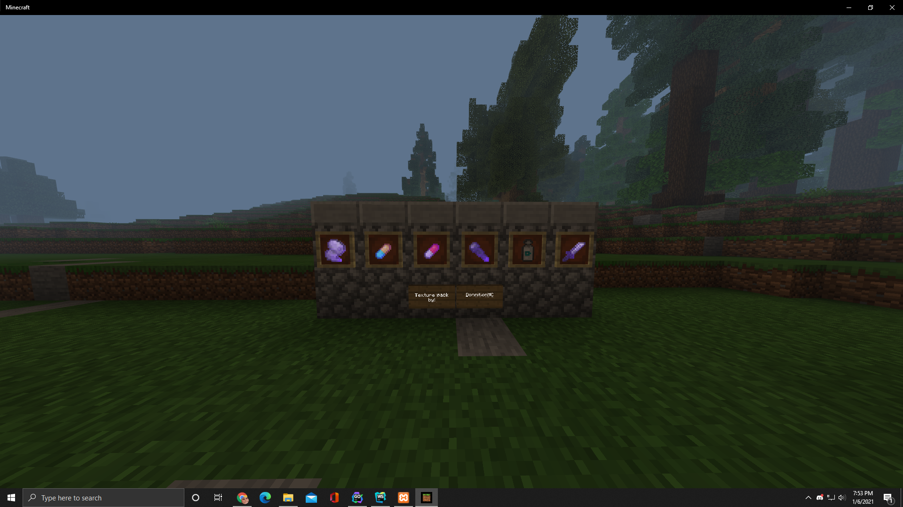
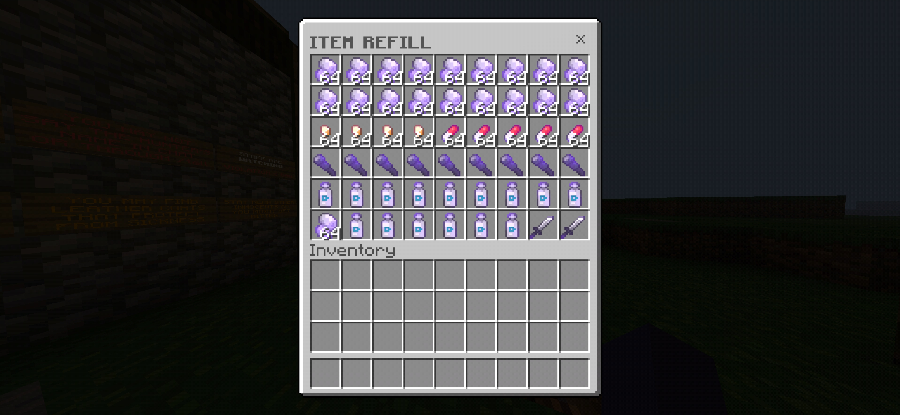
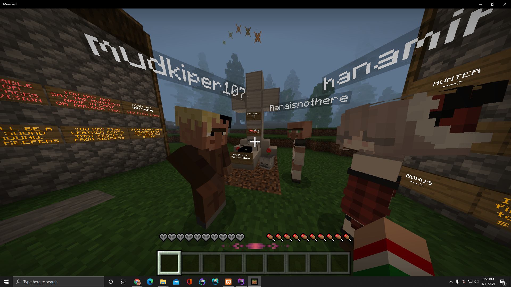

# Euphoria Jager 2021 (outdated)

### This minigame was created by xBeastMode as a fun spooky concept for events held at euphoria (minecraft bedrock server) during the 2021 pandemic lockdown, whoever would kill the most hunters would get the winning price.

# How to play?
There is the Hunter and the Innocents. The Hunter has a one hit kill sword and other items to track and eliminate the Innocents. There are 3 Phases to this game. In Phase 1, Innocents get 90 seconds to collect as many resources as possible from chests before the Nightfall and the Hunter arrive. In Phase 2, Innocents are effected with blindness and can't sprint. They must hide so the Hunter does not find them. In Phase 3, Infection arrives. The resources Innocents collected in Phase 1 will determine if they survive.

The hunter spawns with four items: ONE HIT KILL SWORD, THE SCORPION, 2 BANDAGES, 2 VOLT ENERGY.

Hunter weakness: slowness, cannot easily chase after Innocents.

- One kill sword: does 100% damage on Innocents with 60 seconds cooldown.
- The scorpion: one time use item that can be thrown at Innocents, if picked up by innocent they will be teleported to the hunter for an easy kill, if picked up by hunter will take 10 hearts.
- Bandage: will heal 10 hearts on hunter.
- VOLT ENERGY: temporarily removes hunters slowness.

The Innocents spawn with four items: USED BANDAGE, WEAK ANTI-BIOTIC PILL, WEAK RUBBING ALCOHOL, USED FLASHLIGHT.

Innocent weakness: blindness, no sprint, sickness, infection, water. Why water? Because it's a forested area and it's cold and you get hypothermia.

- USED BANDAGE: can give a small amounts of health or cause infection.
- weak anti-biotic pill: may cure infection but most likely not
- weak running alcohol: may stop infection temporarily but will hurt you if doesn't stop it.
- used flashlight: may temporarily remove blindness.

Items on the hunt: WEAK RUBBING ALCOHOL, WEAK ANTI-BIOTIC PILL, USED BANDAGE, USED FLASHLIGHT, STRONG ANTI-BIOTIC PILL, STRONG RUNNING ALCOHOL, LETHAL SWORD.

These items can be found near places where there is light. Always follow the light! Although there will only be one lethal sword, you will find it on the ground in a random spot.
Tips: watch out, there is a lose wolf and someone watching.

