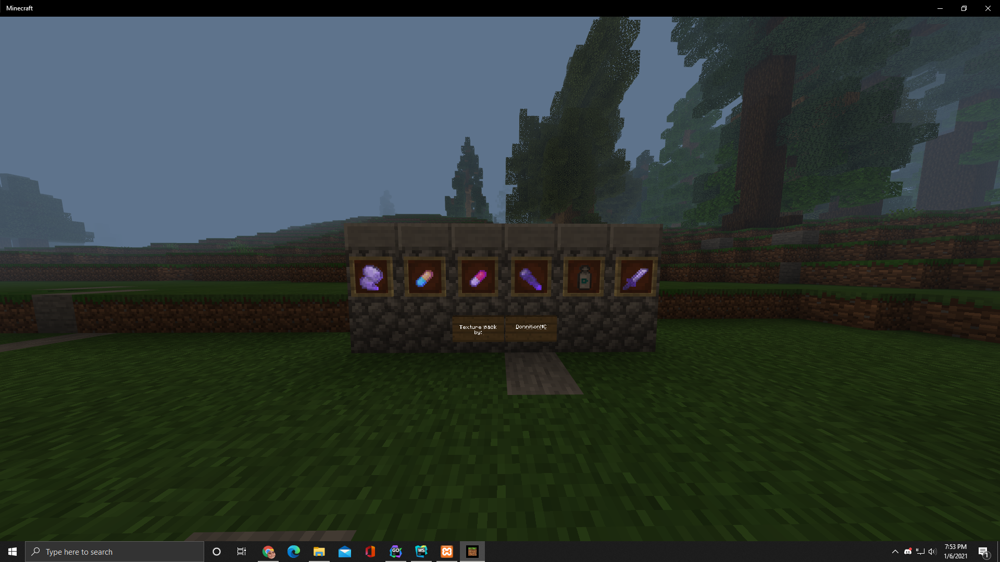
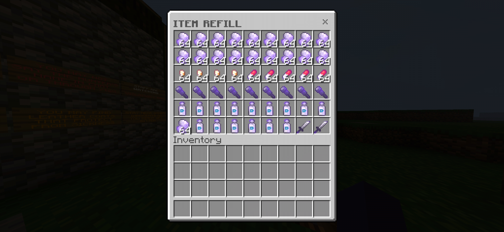
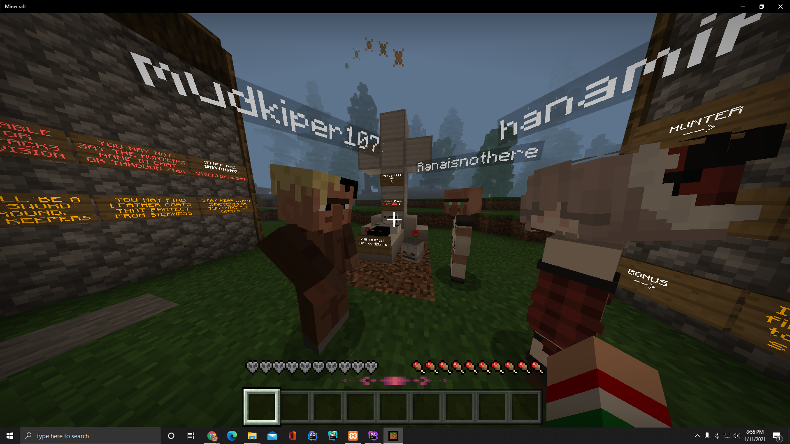

# 🧟 Euphoria Jager (2021) — Archived

A custom **PocketMine-MP minigame** created for events on the *Euphoria* Minecraft: Bedrock Edition server during the 2021 pandemic lockdown.

Players compete in a survival-style game mode where one **Hunter** tracks down multiple **Innocents** across different gameplay phases.

> ⚠️ **Status:** Outdated / archived — kept for portfolio purposes

---

## 🧠 Overview

Euphoria Jager is an asymmetric PvP minigame built around survival, strategy, and tension.

- One player becomes the **Hunter**
- The rest are **Innocents**
- The goal: survive, hide, or outplay the Hunter across multiple phases

The player who eliminates the most opponents (or survives the longest) wins the event.

---

## 🎮 Game Phases

### 🌅 Phase 1 — Preparation (90 seconds)
- Innocents explore and loot chests  
- Gather resources needed for survival  
- Prepare before nightfall  

---

### 🌑 Phase 2 — Hunt Begins
- Hunter enters the game  
- Innocents suffer:
  - Blindness  
  - No sprinting  
- Focus shifts to hiding and survival  

---

### ☣️ Phase 3 — Infection
- Infection mechanics activate  
- Resources collected earlier determine survival chances  
- Increased pressure and difficulty  

---

## ⚔️ Roles & Abilities

### 🩸 Hunter

**Strengths:**
- High damage output  
- Tracking and control tools  

**Weaknesses:**
- Slowness  
- Limited mobility  

**Starting Items:**

| Item | Effect |
|------|--------|
| 🗡️ One-Hit Sword | Instantly kills Innocents (60s cooldown) |
| 🦂 Scorpion | Teleports target to Hunter (single use) |
| 🩹 Bandage (x2) | Heals 10 hearts |
| ⚡ Volt Energy (x2) | Temporarily removes slowness |

---

### 🌿 Innocents

**Strengths:**
- Numbers  
- Resource-based survival  

**Weaknesses:**
- Blindness  
- No sprint  
- Infection risk  
- Environmental hazards (e.g. water → hypothermia)  

**Starting Items:**

| Item | Effect |
|------|--------|
| 🩹 Used Bandage | Small heal or infection risk |
| 💊 Weak Antibiotic | Low chance to cure infection |
| 🧴 Weak Rubbing Alcohol | May delay infection (with risk) |
| 🔦 Used Flashlight | Temporarily removes blindness |

---

## 🧰 Loot System

Items can be found across the map, typically near light sources.

### Possible Loot:
- Used Bandage  
- Weak/Strong Antibiotics  
- Weak/Strong Rubbing Alcohol  
- Flashlights  
- 🗡️ **Lethal Sword (rare)**  

> 💡 Tip: *Follow the light to find loot.*

---

## ⚠️ Gameplay Tips

- Stay hidden during Phase 2  
- Manage infection carefully  
- Use resources strategically  
- Be aware of environmental dangers  
- Not everything is as safe as it seems…  

---

## 🖼️ Screenshots

  
  
  

---

## 🧪 Learning Outcomes

This project demonstrates:

- Event-driven game logic using PocketMine-MP  
- Designing asymmetric multiplayer systems  
- Managing multi-phase gameplay states  
- Creating item-based mechanics and effects  
- Balancing gameplay under constraints  

---

## 💡 Notes

This minigame was developed as part of a live server event and reflects:

- Creative game design  
- Real-time multiplayer systems  
- Rapid prototyping under constraints  
